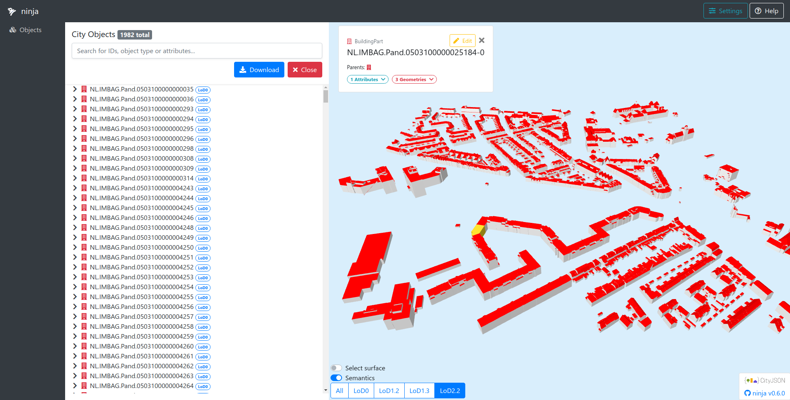

#  ninja



*ninja* is a web viewer for [CityJSON](http://www.cityjson.org) files. It supports most features as described by the CityJSON specification.

*ninja* stands for "**n**inja **i**s **n**ot **j**ust **a**zul" to tease [azul](https://github.com/tudelft3d/azul), the best macOS CityJSON viewer!

# Use

## Public version

You can run `ninja` without installation by visiting [ninja.cityjson.org](https://ninja.cityjson.org).

## Installation

Install all dependencies:

```
npm install
```

### Compile and run for development

```
npm start
```

You can visit the local version at: [http://localhost:1234/](http://localhost:1234).

### Compile and run for production

```
npm run build
```

# Dependencies

*ninja* uses [cityjson-threejs-loader](https://github.com/cityjson/cityjson-threejs-loader) to handle things.

Other frameworks used:
- [three.js](https://threejs.org/)
- [Vue.js](https://vuejs.org/)
- [Bootstrap](https://getbootstrap.com/)
- [Parcel.js](https://parceljs.org/)